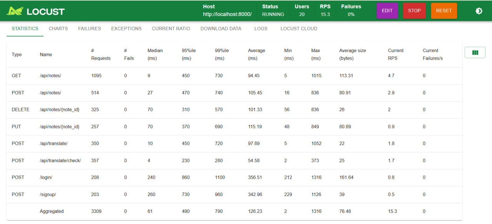

# Simple Notes App

## Overview


## Features
- **User Authentication**
- **Note Management**
- **Translation Service**
- **Data Persistence**
- **Responsive UI**

## Technical Stack
- **Language**: Python 3.11
- **Framework**: FastAPI for REST API
- **API Documentation**: OpenAPI (accessible at `/docs`)
- **Database**: SQLite for persistent storage
- **Front-End**: Streamlit
- **Version Control**: GitHub
- **Containerization**: Docker and Docker Compose
- **Authentication**: JWT (python-jose) with bcrypt (passlib)
- **Translation**: Deep Translate API


## Quality Report

### Maintainability
- **Code Style**: Code follows PEP8 standard ensured by Flake8 on CI
- **Maintainability Index**:

```bash
╰─ poetry run radon mi app/ streamlit_app/ -s
app/main.py - A (100.00)
app/__init__.py - A (100.00)
app/api/auth.py - A (81.44)
app/api/notes.py - A (88.38)
app/api/translation.py - A (100.00)
app/api/__init__.py - A (100.00)
app/core/database.py - A (100.00)
app/core/security.py - A (84.44)
app/db/__init__.py - A (100.00)
app/dependencies/auth.py - A (93.57)
app/models/notes.py - A (100.00)
app/models/translations.py - A (100.00)
app/models/user.py - A (100.00)
app/schemas/note.py - A (100.00)
app/schemas/user.py - A (100.00)
app/services/note_service.py - A (80.73)
app/services/translation_service.py - A (84.64)
streamlit_app/Home.py - A (60.28)
streamlit_app/utils.py - A (73.22)
streamlit_app/__init__.py - A (100.00)
streamlit_app/pages/Notes.py - A (61.15)
streamlit_app/pages/Register.py - A (69.20)
```

API has each file Maintainability Index (MI) higher than 80. On frontend part, main logic bridge file - `utils.py` has MI higher 70, and pages of Streamlit have 60+ 


- **Modularity**: Code organized into reusable modules (`api`, `core`, `models`, `schemas`, `services`).
- **Documentation**: Coverage is 91.0%, also has CI check enabled to not fall below 90%

```bash
╰─ poetry run docstr-coverage app/ streamlit_app/
...
Overall statistics for 22 files (3 files are empty):
Needed: 67  -  Found: 61  -  Missing: 6
Total coverage: 91.0%  -  Grade: Great
```

### Reliability
- **Test Coverage**: Unit tests cover 94% lines of code for an API, for frontend we have other testing

```bash
╰─ poetry run pytest tests/unit/ --cov=app --cov-report=term-missing

Name                                  Stmts   Miss  Cover   Missing
-------------------------------------------------------------------
app/__init__.py                           0      0   100%
app/api/__init__.py                       0      0   100%
app/api/auth.py                          29      2    93%   33, 37
app/api/notes.py                         27      2    93%   82, 108
app/api/translation.py                   17      0   100%
app/core/database.py                     24      0   100%
app/core/security.py                     29      4    86%   11, 60, 81-82
app/db/__init__.py                        0      0   100%
app/dependencies/auth.py                 13      2    85%   28, 31
app/main.py                              10      0   100%
app/models/notes.py                      10      0   100%
app/models/translations.py               11      0   100%
app/models/user.py                        8      0   100%
app/schemas/note.py                      14      0   100%
app/schemas/user.py                      13      0   100%
app/services/note_service.py             27      2    93%   46, 69
app/services/translation_service.py      34      3    91%   17, 20, 76
-------------------------------------------------------------------
TOTAL                                   266     15    94%
```

- **Test Pass Rate**: 100%, ensured by CI
- **Error Handling**: We implemented rollback mechanism if any errors occur, see detailed in `app/core/database.py`
- **Atomic Transactions**: SQLite transactions managed via SQLAlchemy, ensuring data consistency.

Also we have a **mutation testing** to see how application behaves in unexpected scenarios:

```bash
╰─ poetry run mutmut run
⠋ Generating mutants
    done in 1201ms
⠋ Running stats
    done
⠴ Running clean tests
    done
⠋ Running forced fail test
    done
Running mutation testing
⠦ 55/55  🎉 50 🫥 0  ⏰ 0  🤔 0  🙁 5  🔇 0
2.16 mutations/second
```

As we can see, most of the mutants are killed. 

TODO for us in the future, discover anomaly of translation service which brings 40 survived mutants (we guess all of them surviving for some reason, so we forced to exclude it from mutation...) and fix other survided 5-7 as well.

To simulate how potentially user will interact with our system - we made a **UI testing** with SeleniumBase:

```
...
poetry run pytest selenium/ --browser=chrome --headless
============================= test session starts ==============================
platform linux -- Python 3.11.12, pytest-8.3.5, pluggy-1.5.0
rootdir: /home/runner/work/SQRS_Project-Simple-Notes-App/SQRS_Project-Simple-Notes-App/simple_notes_app
configfile: pyproject.toml
plugins: metadata-3.1.1, xdist-3.6.1, cov-6.1.1, anyio-4.9.0, rerunfailures-15.0, Faker-37.1.0, seleniumbase-4.37.0, ordering-0.6, html-4.0.2
collected 2 items

selenium/test_selenium.py ..                                             [100%]

============================== 2 passed in 29.03s ==============================
```

It's from CI, but to test it locally and see how it really simulates browser, set option to `--headed`. For slower showcase use also `--demo` option.

### Performance

To analyze performance of our application we used Locust. We set number of concurrent users to 20 to see if minimal amount of users requirement can be satisfied (5 minutes run):



Average response time is less than 150 ms

### Security

- We used `bandit` to check if we have any critical vulnerabilities, also used it on CI to identify on push if any (everything, except testing files)
- Passwords hashed using `bcrypt`
- Ensured that we have no user sensitive data leakage on API responses
- JWT expiration set to 30 minutes to make shorter long-term access and enhance users protection

## Project Structure
```
.
├── .streamlit
│   └── config.toml
├── app
│   ├── api
│   │   ├── __init__.py
│   │   ├── auth.py
│   │   ├── notes.py
│   │   └── translation.py
│   ├── core
│   │   ├── database.py
│   │   └── security.py
│   ├── db
│   │   ├── __init__.py
│   │   └── notes.db
│   ├── dependencies
│   │   └── auth.py
│   ├── models
│   │   ├── notes.py
│   │   ├── translations.py
│   │   └── user.py
│   ├── schemas
│   │   ├── note.py
│   │   └── user.py
│   ├── services
│   │   ├── note_service.py
│   │   └── translation_service.py
│   ├── __init__.py
│   └── main.py
├── selenium
│   └── test_selenium.py
├── streamlit_app
│   ├── pages
│   │   ├── Notes.py
│   │   └── Register.py
│   ├── Home.py
│   ├── __init__.py
│   └── utils.py
├── tests
│   ├── performance
│   │   └── locustfile.py
│   ├── unit
│   │   ├── __init__.py
│   │   └── test_api.py
│   └── __init__.py
├── .coverage
├── .env
├── .env.example
├── Dockerfile
├── docker-compose.yml
├── poetry.lock
└── pyproject.toml
```


## Setup and Installation

### Prerequisites

You can run the project using **either Docker** or **Python 3.11 + Poetry**.

* **Option 1: Docker**:

  * Docker
  * Docker Compose

* **Option 2: Poetry**:

  * Python 3.11
  * Poetry (install via `pip install poetry`)

---

### Steps


1. **Clone the Repository**:

```bash
git clone https://github.com/TheAnushervon/SQRS_Project-Simple-Notes-App.git
cd SQRS_Project-Simple-Notes-App/simple_notes_app
```

Create `.env` from `.env.example`

---

### Option 1: Run with Docker

2. **Build and Run the Application**:

```bash
docker-compose up --build
```

---

### Option 2: Run with Python 3.11 + Poetry

2. **Install Dependencies**:

```bash
poetry install --no-root
```

3. **Run the Application**:

```bash
poetry run uvicorn app.main:app --reload
```

4. **Run the front end (separate terminal)**

```bash
PYTHONPATH=. poetry run streamlit run streamlit_app/Home.py --server.address=0.0.0.0
```


### Access the Application

- Open `http://localhost:8000` in your browser.
- Register a new user, log in, and manage notes at `/notes`.
- View API documentation at `http://localhost:8000/docs`.


## API Documentation
The REST API is documented using OpenAPI, accessible at `http://localhost:8000/docs`. Key endpoints include:
- `POST /signup`: Register a new user.
- `POST /login`: Authenticate and receive a JWT token.
- `GET /api/notes`: Retrieve all notes for the authenticated user.
- `POST /api/notes`: Create a new note.
- `PUT /api/notes/{note_id}`: Update a note.
- `DELETE /api/notes/{note_id}`: Delete a note.
- `POST /api/translate`: Translate given text.
- `POST /api/translate/check`: Check if text should be translated to English

## Team and Contribution

Anushervon Qodirzoda | a.qodirzoda@innopolis.university
  
- Database
- API: Notes, Authorization
- Docker

Iliyas Dzhabbarov | i.dzhabbarov@innopolis.university

- API: Translation
- Frontend on Streamlit

Muhammad Allayarov | m.allayarov@innopolis.university

- Testing: Unit, Mutation, Performance, UI
- Documentation
